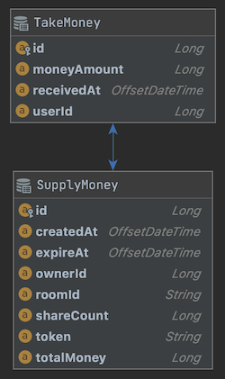

### 프로젝트 구성
- Java 1.8
- Spring Boot
- JPA
- H2
- Gradle

### 실행
```bash
$ ./gradlew build

$ java -jar supply-money-0.0.1-SNAPSHOT.jar
```

### DB Schema
- SupplyMoney : 뿌리기 정보
- TakeMoney : 돈 줍기
- 

### 설계 시 고려된 부분
- 기본적인 돈 뿌리기, 돈 가져가기, 조회 기능에 충실했다.
    - 일단은 요구사항이 복잡하지 않아 예외 처리에 더 중점을 두었다.
- Token생성시 단순히 3자리만 이용한다면 중복이 매우 많겠지만 token, ownerId, roomId, 그리고 expireAt필드를 같이 키로 사용하면 중복이 있더라도 그 확률은 매우 낮아진다. 만약 그게 아니라면 MSA로 구성하던지, Hazelcast같은 솔루션을 써야겠지만 이 정도면 충분해 보인다.
- Scale-out하게 된다면 datasource를 바꿔주는 것 정도로 가능하다고 생각했다.

### 추가적으로 고려되어야 할 부분
- 다른 통화를 사용하는 유저끼리 돈을 뿌리면 문제가 생길 수 있으므로 통화의 타입을 두어야 한다. (KRW, USD등)
- 최대 사용자수에 대한 제한이 없다면 돈 뿌리기를 할 때 너무 많은 Insert Query가 생길 수 있으므로 돈 받아가기를 할 때 가져갈 돈을 계산하는 것이 나아 보인다.
- 돈을 뿌릴 수 있는 최대 금액에 대한 상한이 없다면 BigDecimal을 쓰는 것이 맞다. 하지만 돈 뿌리기에 대한 정확한 기획 의도를 알 수 없으므로 일단 Long으로 처리 했다.
- 7일이 지나 필요 없어진 데이터는 다른 테이블로 옮겨 두었다가 운영에서도 필요 없는 기간이 지나면 백업을 하던지, 삭제를 하던지 정책에 따라 처리해야 할 것.

### API
1. 뿌리기 API

    Request
    - URI : /api/v1/kakaopay/supplymoney
    - Http Method : POST
    - Headers
        - X-USER-ID : 머니를 뿌리는 사용자 아이디 ( 숫자)
        - X-ROOM-ID : 머니를 뿌리는 채팅방 아이디
        
    Body
    ```cpp
    {
         "totalMoney":"100000",
         "shareCount":"5"
    }
    ```

    Response
    ```json
    {
    	"errCode": "000",
    	"errMsg": "Operation Success",
    	"result": {
    		"token": "NqX"
    	}
    }
    ```

2. 받기 API
    Request
    - URI : /api/v1/kakaopay/takemoney/{token}
    - Http Method : PUT
    - Headers
        - X-USER-ID : 머니를 가져갈 유저 아이디
        - X-ROOM-ID : 머니를 분배하는 방 아이디
        - X-TOKEN : 뿌리기 요청에 대한 고유 토큰

    Response
    ```json
    {
    	"errCode": "000",
    	"errMsg": "Operation Success",
    	"result": {
    	"takenMoney": 28525
    	}
    }
    ```

3. 조회 API
    Request
    - URI : /api/v1/kakaopay/descsupplymoney/{token}
    - Http Method : GET
    - Headers
        - X-USER-ID
        - X-ROOM-ID
        - X-TOKEN

    Response
    ```json
    {
    	"errCode": "000",
    	"errMsg": "Operation Success",
    	"result": {
    		"token": "NqX",
    		"createdAt": "2020-11-23T20:36:35.959075",
    		"expireAt": "2020-11-23T20:46:35.959075",
    		"totalMoney": 100000,
    		"takenMoney": 28525,
    		"takenList": [
    		  {
    			"userId": 12984912,
    			"takenMoney": 28525
    			},
    			  {
    			"userId": null,
    			"takenMoney": 60543
    			},
    			  {
    			"userId": null,
    			"takenMoney": 425
    			},
    			  {
    			"userId": null,
    			"takenMoney": 1244
    			},
    			  {
    			"userId": null,
    			"takenMoney": 9263
    			}
    		],
    	}
    }
    ```
